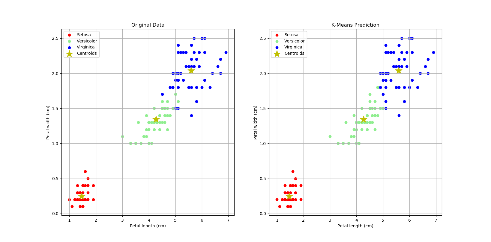

# Sklearn: K-Means

### **Using K-Means Sklearn on Python**

**K-means** clustering is a method of vector quantization, originally from signal processing, that is popular for cluster analysis in data mining. K-means clustering aims to partition _n_ observations into _k_ clusters in which each observation belongs to the cluster with the nearest mean, serving as a prototype of the cluster. This results in a partitioning of the data space into _Voronoi cells_.

Clone/download this repo, open & run python script: __*4_iris.py*__. It will create a figure with 2 plots: the original dataset & K-means prediction. Make sure you have installed __*pandas*__, __*numpy*__, __*matplotlib*__ & __*sklearn*__ packages!

```python

import numpy as np
import pandas as pd
import matplotlib.pyplot as plt
from sklearn.datasets import load_iris

iris = load_iris()
print(dir(iris))

# create dataframe
dfIris = pd.DataFrame(
    iris['data'],
    columns = ['sepalL', 'sepalW', 'petalL', 'petalW']
)
dfIris['target'] = iris['target']
dfIris['jenis'] = dfIris['target'].apply(
    lambda x: iris['target_names'][x]
)
# print(dfIris.head())

# split dataset: dfSetosa, dfVersicolor, dfVirginica
dfSetosa = dfIris[dfIris['jenis'] == 'setosa']
dfVersicolor = dfIris[dfIris['jenis'] == 'versicolor']
dfVirginica = dfIris[dfIris['jenis'] == 'virginica']

print(dfSetosa)
print(dfVersicolor)
print(dfVirginica)

# kmeans
from sklearn.cluster import KMeans
model = KMeans(n_clusters = 3, random_state=0)

# training
model.fit(dfIris[['petalL', 'petalW']])

# prediction
prediksi = model.predict(dfIris[['petalL', 'petalW']])
print(prediksi)
dfIris['prediksi'] = prediksi
print(dfIris)

# split dataset: dfSetosaP, dfVersicolorP, dfVirginicaP
dfSetosaP = dfIris[dfIris['prediksi'] == 0]
dfVersicolorP = dfIris[dfIris['prediksi'] == 2]
dfVirginicaP = dfIris[dfIris['prediksi'] == 1]

# centroids
centroid = model.cluster_centers_
print(centroid)

# plot original vs k-means prediction
plt.figure('K-Means', figsize = (14,7))

# plot petal length vs petal width (original)
plt.subplot(121)
plt.scatter(
    dfSetosa['petalL'],
    dfSetosa['petalW'],
    color = 'r'
)
plt.scatter(
    dfVersicolor['petalL'],
    dfVersicolor['petalW'],
    color = 'lightgreen'
)
plt.scatter(
    dfVirginica['petalL'],
    dfVirginica['petalW'],
    color = 'b'
)

# plot centroids
plt.scatter(
    centroid[:,0],
    centroid[:,1],
    marker = '*',
    color = 'y',
    s = 300
)

plt.legend(['Setosa', 'Versicolor', 'Virginica', 'Centroids'])
plt.xlabel('Petal length (cm)')
plt.ylabel('Petal width (cm)')
plt.title('Original Data')
plt.grid(True)

# plot petal length vs petal width (prediction)
plt.subplot(122)
plt.scatter(
    dfSetosaP['petalL'],
    dfSetosaP['petalW'],
    color = 'r'
)
plt.scatter(
    dfVersicolorP['petalL'],
    dfVersicolorP['petalW'],
    color = 'lightgreen'
)
plt.scatter(
    dfVirginicaP['petalL'],
    dfVirginicaP['petalW'],
    color = 'b'
)

# plot centroids
plt.scatter(
    centroid[:,0],
    centroid[:,1],
    marker = '*',
    color = 'y',
    s = 300
)

plt.legend(['Setosa', 'Versicolor', 'Virginica', 'Centroids'])
plt.xlabel('Petal length (cm)')
plt.ylabel('Petal width (cm)')
plt.title('K-Means Prediction')
plt.grid(True)

plt.show()

```



#

#### Lintang Wisesa :love_letter: _lintangwisesa@ymail.com_

[Facebook](https://www.facebook.com/lintangbagus) | 
[Twitter](https://twitter.com/Lintang_Wisesa) |
[Google+](https://plus.google.com/u/0/+LintangWisesa1) |
[Youtube](https://www.youtube.com/user/lintangbagus) | 
:octocat: [GitHub](https://github.com/LintangWisesa) |
[Hackster](https://www.hackster.io/lintangwisesa)